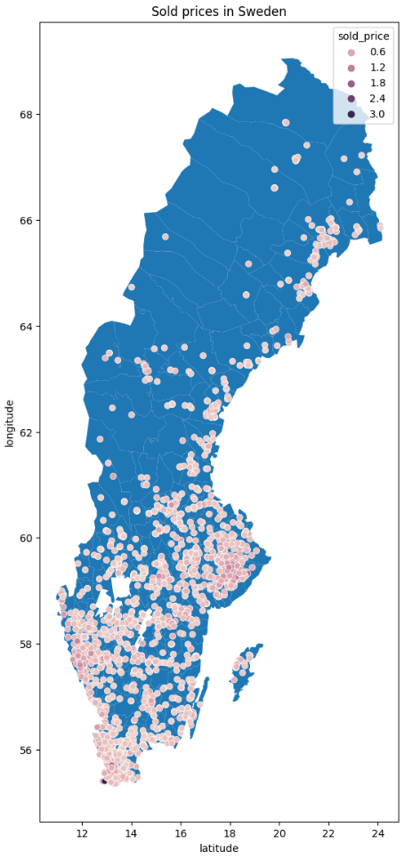
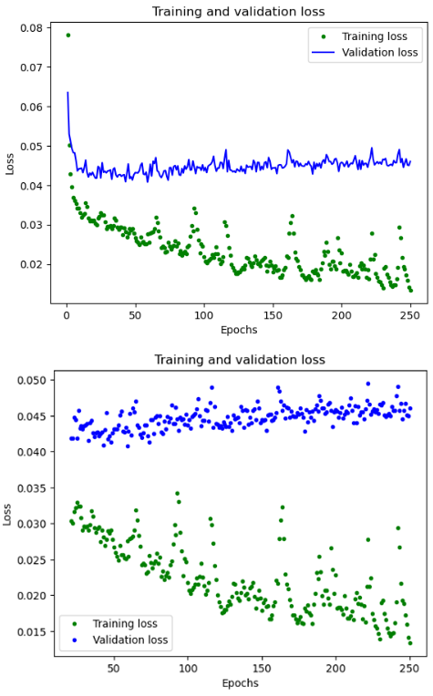
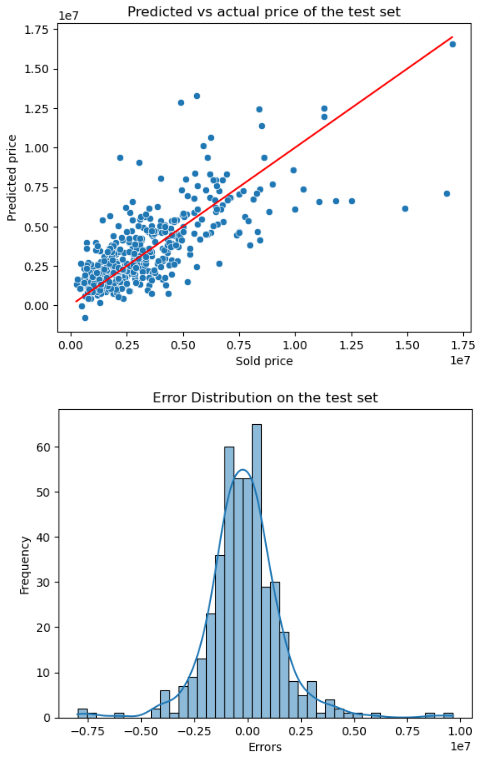

# Predicting house prices using machine learning
**DISCLAIMER - This project is for personal learning and should not be used as a guide**

Having a model that can predict house prices using data such as  such as location, size and room count could be very useful for a entity like a brokerage firm. My goal initially was to predict a house prices in Sweden using a existing data set, but i could not find one that had everything i was looking for so I decided to instead scrape the data from [Hemnet](https://www.hemnet.se/) which is the biggest online market place for the sale of properties.

I will limit the scope of the project to only villas, which means properties such as apartments or terraced houses will be excluded. I will also limit the data to sales happened in the last 12 months.

## **Goals:**
- Collecting data by scraping it from [Hemnet](https://www.hemnet.se/).
- Data exploration, feature development and processing. 
- Create and train a machine learning model using TensorFlow.
- Model evaluation and statistical analysis.

## **Preperation of data**
Since the data does not exist yet the first step is to scrape it from [Hemnet](https://www.hemnet.se/). To do this i will be using [BeautifulSoup4](https://www.crummy.com/software/BeautifulSoup/bs4/doc/) which is a very powerful library for scraping and parsing HTML content to extract data. All the code for the scraping can be found in the scraping folder. The unprocced data can be found in [house_properties_data.csv](https://github.com/Dan-Irl/House-Price-Prediction/blob/main/house_properties_data.csv).

Next step is the data processing and feature exploration. After basic processing such as removing NaN values i ended up with 2214 entries, which is a worrying low amount of data point when training a machine learning model but for the sake of learning i think this is acceptable. Two features were added to the data set, "living to land ratio" and "area per room" which seemed to be somewhat correlated to the sale price. The final correlation table can be seen below. We observe that we have a few features that are correlated with the sold price target.


</br>
</br>


### **Location** 
Then i decided to plot the coordinates of all the sold houses to get a good overview locational biases. We observe that most of the data is from southern Sweden which might introduce some locational bias but as we see in the correlation table latitude and longitude are not that highly correlated to the sold price of a house. This just means that the model will probably perform better in southern Sweden we have a larger amount of data point from there. 



</br>
</br>


## **Model results**
The data was split into training and test with a 80% to 20% split, the training data was then split in a similar way to form the validation set.

The Keras model was structured in the following way:

```python
def housePrices_model(preprocessing_head, inputs):
  body = tf.keras.Sequential([
    layers.Dense(128,activation='relu', kernel_regularizer=regularizers.l2(0.001)),
    layers.Dense(64,activation='relu'),
    layers.Dense(32,activation='relu'),
    layers.Dense(1)
  ])
  ```

Where from the 12 input features we have 128 fully connected neurons which we then reduce until we have 32 dense neurons which connect to our output neuron. 

The model was trained for 250 epochs. Below we see a plot of the training and validation loss against epochs. The loss is quite jumpy which a assume is because of the small data set. 


</br>
</br>

### **Test evaluation**

To evaluate the model i choose two common ways of visualizing the performance of a model. When training a model for production a much more rigorous evaluation is needed. In the left side of the plot bellow we have an equality plot where actual sold price is plotted against predicted price, optimally all point should lay on the red line which is the line where prediction and actual price is the same. What we can observe from the plot is that the error is equally distributed around the equality line, this means the model does not have a bias towards under or over predicting the price.

In the right plot we have a histogram of the error between actual and predicted price. this plot confirms the normal distribution of the error which we saw the equality plot. It quite evident from these plots that the model has the capability to predict house prices for a large portion of the data set but we also observe quite large errors for some outliers. To determine the cause of these errors one could first increase the number of data points if possible, then do a hyperparameter analysis to try and find the optimal model setup for this task.  


</br>
</br>

The statistical t-test was also performed on the model with the test set. It showed that the model performance was not statistically significant within a 95% confidence interval, but this was to expected from the result above. 

## **Conclusion**
To summarize this whole project, i set out with 4 goals in mind and i would say they all have been fulfilled.

- Collecting data by scraping it from [Hemnet](https://www.hemnet.se/). :white_check_mark:
- Data exploration, feature development and processing. :white_check_mark:
- Create and train a machine learning model using TensorFlow. :white_check_mark:
- Model evaluation and statistical analysis. :white_check_mark:

The scope of the project was never to make a production ready highly accurate model, it was to learn some important skills within data science and machine learning. 